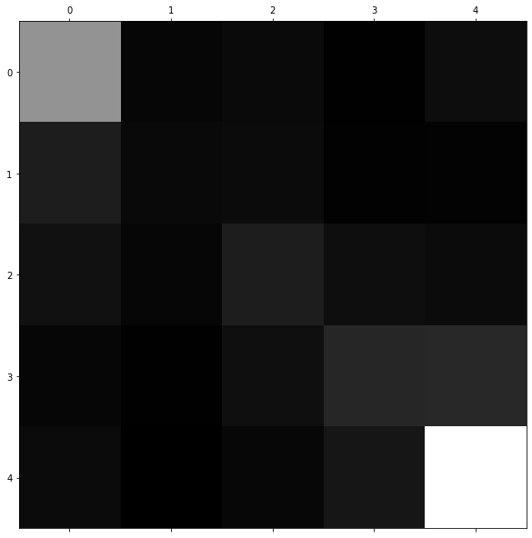

# Android App Rating Analyer 
* Model - Google Bert
* Inputs - Rate, Comment
* ~100K data records


```python
######################################################################
### Auther: Asiri Amal K                                          ####
### Date  : 14/12/2019                                            ####
### Supervisor : abhiphull15                                      ####
### Description: Training Model using Pre-trained BERT model      ####
######################################################################
```


```python
import pandas as pd
import numpy as np
from matplotlib import pyplot as plt
from sklearn.preprocessing import LabelEncoder
from sklearn.model_selection import train_test_split

import torch
import pickle
from torch.utils.data import (DataLoader, RandomSampler, SequentialSampler, TensorDataset)
from torch.nn import CrossEntropyLoss, MSELoss

from tqdm import tqdm_notebook, trange
import os
from pytorch_pretrained_bert import BertTokenizer, BertModel, BertForMaskedLM, BertForSequenceClassification
from pytorch_pretrained_bert.optimization import BertAdam, WarmupLinearSchedule

from multiprocessing import Pool, cpu_count
from run_classifier import *
import convert_examples_to_features

# OPTIONAL: if you want to have more information on what's happening, activate the logger as follows
import logging
logging.basicConfig(level=logging.INFO)

device = torch.device("cuda" if torch.cuda.is_available() else "cpu")
```


```python
rates = pd.read_csv("android_reviews_100k.csv")
```


```python
# The input data dir. Should contain the .tsv files (or other data files) for the task.
DATA_DIR = "data/"

# Bert pre-trained model selected in the list: bert-base-uncased, 
# bert-large-uncased, bert-base-cased, bert-large-cased, bert-base-multilingual-uncased,
# bert-base-multilingual-cased, bert-base-chinese.
BERT_MODEL = 'yelp.tar.gz'

# The name of the task to train.I'm going to name this 'yelp'.
TASK_NAME = 'yelp'

# The output directory where the fine-tuned model and checkpoints will be written.
OUTPUT_DIR = f'outputs/{TASK_NAME}/'

# The directory where the evaluation reports will be written to.
REPORTS_DIR = f'reports/{TASK_NAME}_evaluation_reports/'

# This is where BERT will look for pre-trained models to load parameters from.
CACHE_DIR = 'cache/'

# The maximum total input sequence length after WordPiece tokenization.
# Sequences longer than this will be truncated, and sequences shorter than this will be padded.
MAX_SEQ_LENGTH = 128

TRAIN_BATCH_SIZE = 24
EVAL_BATCH_SIZE = 8
LEARNING_RATE = 2e-5
NUM_TRAIN_EPOCHS = 1
RANDOM_SEED = 42
GRADIENT_ACCUMULATION_STEPS = 1
WARMUP_PROPORTION = 0.1
OUTPUT_MODE = 'classification'

CONFIG_NAME = "config.json"
WEIGHTS_NAME = "pytorch_model.bin"
```

### Check the dataset


```python
rates.head()
```


<div>
<style scoped>
    .dataframe tbody tr th:only-of-type {
        vertical-align: middle;
    }

    .dataframe tbody tr th {
        vertical-align: top;
    }

    .dataframe thead th {
        text-align: right;
    }
</style>
<table border="1" class="dataframe">
  <thead>
    <tr style="text-align: right;">
      <th></th>
      <th>Unnamed: 0</th>
      <th>rating</th>
      <th>review</th>
    </tr>
  </thead>
  <tbody>
    <tr>
      <th>0</th>
      <td>0</td>
      <td>4</td>
      <td>anyone know how to get FM tuner on this launch...</td>
    </tr>
    <tr>
      <th>1</th>
      <td>1</td>
      <td>2</td>
      <td>Developers of this app need to work hard to fi...</td>
    </tr>
    <tr>
      <th>2</th>
      <td>2</td>
      <td>4</td>
      <td>This app works great on my joying Android base...</td>
    </tr>
    <tr>
      <th>3</th>
      <td>3</td>
      <td>1</td>
      <td>Shouldn't of paid for the full version and sho...</td>
    </tr>
    <tr>
      <th>4</th>
      <td>4</td>
      <td>5</td>
      <td>i love the fact that it turns you phone into a...</td>
    </tr>
  </tbody>
</table>
</div>


```python
# We have exact 99995 records
rates.shape
```


    (99995, 3)


### Columns are
1. Unnamed: 0
2. rating
3. review


```python
rates.columns
```


    Index(['Unnamed: 0', 'rating', 'review'], dtype='object')


### First Column is unnecessary it only includes the line number so it should be removed


```python
# rates = rates.drop('Unnamed: 0', axis=1)
```


```python
rates.head()
```


<div>
<style scoped>
    .dataframe tbody tr th:only-of-type {
        vertical-align: middle;
    }

    .dataframe tbody tr th {
        vertical-align: top;
    }

    .dataframe thead th {
        text-align: right;
    }
</style>
<table border="1" class="dataframe">
  <thead>
    <tr style="text-align: right;">
      <th></th>
      <th>Unnamed: 0</th>
      <th>rating</th>
      <th>review</th>
    </tr>
  </thead>
  <tbody>
    <tr>
      <th>0</th>
      <td>0</td>
      <td>4</td>
      <td>anyone know how to get FM tuner on this launch...</td>
    </tr>
    <tr>
      <th>1</th>
      <td>1</td>
      <td>2</td>
      <td>Developers of this app need to work hard to fi...</td>
    </tr>
    <tr>
      <th>2</th>
      <td>2</td>
      <td>4</td>
      <td>This app works great on my joying Android base...</td>
    </tr>
    <tr>
      <th>3</th>
      <td>3</td>
      <td>1</td>
      <td>Shouldn't of paid for the full version and sho...</td>
    </tr>
    <tr>
      <th>4</th>
      <td>4</td>
      <td>5</td>
      <td>i love the fact that it turns you phone into a...</td>
    </tr>
  </tbody>
</table>
</div>


#### Checking the missing values

* No missing values


```python
rates.isnull().sum()
```


    Unnamed: 0    0
    rating        0
    review        0
    dtype: int64


#### Checking the outliers

###### Ratings must between 1-5, If any number will be an outlier
* No outliers is detected in the dataset 


```python
rates["rating"].value_counts()
```


    5    40841
    1    25215
    4    14624
    3    11267
    2     8048
    Name: rating, dtype: int64


```python
id_df = pd.DataFrame(rates['Unnamed: 0'].values, columns=["id"])
```


```python
id_df.head()
```


<div>
<style scoped>
    .dataframe tbody tr th:only-of-type {
        vertical-align: middle;
    }

    .dataframe tbody tr th {
        vertical-align: top;
    }

    .dataframe thead th {
        text-align: right;
    }
</style>
<table border="1" class="dataframe">
  <thead>
    <tr style="text-align: right;">
      <th></th>
      <th>id</th>
    </tr>
  </thead>
  <tbody>
    <tr>
      <th>0</th>
      <td>0</td>
    </tr>
    <tr>
      <th>1</th>
      <td>1</td>
    </tr>
    <tr>
      <th>2</th>
      <td>2</td>
    </tr>
    <tr>
      <th>3</th>
      <td>3</td>
    </tr>
    <tr>
      <th>4</th>
      <td>4</td>
    </tr>
  </tbody>
</table>
</div>


```python
rate_df = rates["review"]
```

### Encode the label


```python
from sklearn.preprocessing import LabelBinarizer
encoder = LabelBinarizer()
rates_cat_1hot = encoder.fit_transform(rates["rating"])
rating_df = pd.DataFrame(rates_cat_1hot, columns=encoder.classes_)
df = pd.concat([id_df, rate_df, rating_df], axis=1)
df.head()
```


<div>
<style scoped>
    .dataframe tbody tr th:only-of-type {
        vertical-align: middle;
    }

    .dataframe tbody tr th {
        vertical-align: top;
    }

    .dataframe thead th {
        text-align: right;
    }
</style>
<table border="1" class="dataframe">
  <thead>
    <tr style="text-align: right;">
      <th></th>
      <th>id</th>
      <th>review</th>
      <th>1</th>
      <th>2</th>
      <th>3</th>
      <th>4</th>
      <th>5</th>
    </tr>
  </thead>
  <tbody>
    <tr>
      <th>0</th>
      <td>0</td>
      <td>anyone know how to get FM tuner on this launch...</td>
      <td>0</td>
      <td>0</td>
      <td>0</td>
      <td>1</td>
      <td>0</td>
    </tr>
    <tr>
      <th>1</th>
      <td>1</td>
      <td>Developers of this app need to work hard to fi...</td>
      <td>0</td>
      <td>1</td>
      <td>0</td>
      <td>0</td>
      <td>0</td>
    </tr>
    <tr>
      <th>2</th>
      <td>2</td>
      <td>This app works great on my joying Android base...</td>
      <td>0</td>
      <td>0</td>
      <td>0</td>
      <td>1</td>
      <td>0</td>
    </tr>
    <tr>
      <th>3</th>
      <td>3</td>
      <td>Shouldn't of paid for the full version and sho...</td>
      <td>1</td>
      <td>0</td>
      <td>0</td>
      <td>0</td>
      <td>0</td>
    </tr>
    <tr>
      <th>4</th>
      <td>4</td>
      <td>i love the fact that it turns you phone into a...</td>
      <td>0</td>
      <td>0</td>
      <td>0</td>
      <td>0</td>
      <td>1</td>
    </tr>
  </tbody>
</table>
</div>


```python
df.columns
```


    Index(['id', 'review', 1, 2, 3, 4, 5], dtype='object')


```python
df['labels'] = list(zip(df[1].tolist(), df[2].tolist(), df[3].tolist(), df[4].tolist(),  df[5].tolist()))
df['text'] = df['review'].apply(lambda x: x.replace('\n', ' '))
```

##### Train, Test Split

* Test set will be 0.2 from the original dataset


```python
from sklearn.model_selection import train_test_split


train_df, eval_df = train_test_split(df, test_size=0.2, random_state=42)
```


```python
# Training set size: 89995
# Test set size    : 10000
print(train_df.shape)
eval_df.shape
```

    (79996, 9)
    


    (19999, 9)


```python
train_df.head()
```


<div>
<style scoped>
    .dataframe tbody tr th:only-of-type {
        vertical-align: middle;
    }

    .dataframe tbody tr th {
        vertical-align: top;
    }

    .dataframe thead th {
        text-align: right;
    }
</style>
<table border="1" class="dataframe">
  <thead>
    <tr style="text-align: right;">
      <th></th>
      <th>id</th>
      <th>review</th>
      <th>1</th>
      <th>2</th>
      <th>3</th>
      <th>4</th>
      <th>5</th>
      <th>labels</th>
      <th>text</th>
    </tr>
  </thead>
  <tbody>
    <tr>
      <th>92722</th>
      <td>19</td>
      <td>It's more fun and great  if you can add cut an...</td>
      <td>0</td>
      <td>0</td>
      <td>0</td>
      <td>0</td>
      <td>1</td>
      <td>(0, 0, 0, 0, 1)</td>
      <td>It's more fun and great  if you can add cut an...</td>
    </tr>
    <tr>
      <th>25159</th>
      <td>5</td>
      <td>The great game I have played</td>
      <td>0</td>
      <td>0</td>
      <td>0</td>
      <td>0</td>
      <td>1</td>
      <td>(0, 0, 0, 0, 1)</td>
      <td>The great game I have played</td>
    </tr>
    <tr>
      <th>38240</th>
      <td>12</td>
      <td>Thx For making this app</td>
      <td>0</td>
      <td>0</td>
      <td>0</td>
      <td>0</td>
      <td>1</td>
      <td>(0, 0, 0, 0, 1)</td>
      <td>Thx For making this app</td>
    </tr>
    <tr>
      <th>3806</th>
      <td>0</td>
      <td>Have to start at begining of 1st level when fa...</td>
      <td>0</td>
      <td>0</td>
      <td>1</td>
      <td>0</td>
      <td>0</td>
      <td>(0, 0, 1, 0, 0)</td>
      <td>Have to start at begining of 1st level when fa...</td>
    </tr>
    <tr>
      <th>67881</th>
      <td>30</td>
      <td>This app is usefull.Its a successful  app and ...</td>
      <td>0</td>
      <td>0</td>
      <td>0</td>
      <td>0</td>
      <td>1</td>
      <td>(0, 0, 0, 0, 1)</td>
      <td>This app is usefull.Its a successful  app and ...</td>
    </tr>
  </tbody>
</table>
</div>


```python
eval_df.head()
```


<div>
<style scoped>
    .dataframe tbody tr th:only-of-type {
        vertical-align: middle;
    }

    .dataframe tbody tr th {
        vertical-align: top;
    }

    .dataframe thead th {
        text-align: right;
    }
</style>
<table border="1" class="dataframe">
  <thead>
    <tr style="text-align: right;">
      <th></th>
      <th>id</th>
      <th>review</th>
      <th>1</th>
      <th>2</th>
      <th>3</th>
      <th>4</th>
      <th>5</th>
      <th>labels</th>
      <th>text</th>
    </tr>
  </thead>
  <tbody>
    <tr>
      <th>33967</th>
      <td>30</td>
      <td>This theme is very nyc.</td>
      <td>0</td>
      <td>0</td>
      <td>1</td>
      <td>0</td>
      <td>0</td>
      <td>(0, 0, 1, 0, 0)</td>
      <td>This theme is very nyc.</td>
    </tr>
    <tr>
      <th>31049</th>
      <td>5</td>
      <td>Blink as an app is stuck on the authentication...</td>
      <td>0</td>
      <td>0</td>
      <td>0</td>
      <td>1</td>
      <td>0</td>
      <td>(0, 0, 0, 1, 0)</td>
      <td>Blink as an app is stuck on the authentication...</td>
    </tr>
    <tr>
      <th>53746</th>
      <td>32</td>
      <td>There's a possible loophole in expertise mayb ...</td>
      <td>0</td>
      <td>0</td>
      <td>0</td>
      <td>0</td>
      <td>1</td>
      <td>(0, 0, 0, 0, 1)</td>
      <td>There's a possible loophole in expertise mayb ...</td>
    </tr>
    <tr>
      <th>9732</th>
      <td>5</td>
      <td>I have Internet and every thing works like a c...</td>
      <td>1</td>
      <td>0</td>
      <td>0</td>
      <td>0</td>
      <td>0</td>
      <td>(1, 0, 0, 0, 0)</td>
      <td>I have Internet and every thing works like a c...</td>
    </tr>
    <tr>
      <th>7129</th>
      <td>39</td>
      <td>Nice! But updates intermittently. Love the loo...</td>
      <td>0</td>
      <td>0</td>
      <td>0</td>
      <td>1</td>
      <td>0</td>
      <td>(0, 0, 0, 1, 0)</td>
      <td>Nice! But updates intermittently. Love the loo...</td>
    </tr>
  </tbody>
</table>
</div>


```python
from simpletransformers.classification import MultiLabelClassificationModel


model = MultiLabelClassificationModel('roberta', 'roberta-base', num_labels=5, args={'train_batch_size':2, 'gradient_accumulation_steps':16, 'learning_rate': 3e-5, 'num_train_epochs': 3, 'max_seq_length': 512})
```

    INFO:transformers.file_utils:PyTorch version 1.3.1 available.
    INFO:transformers.configuration_utils:loading configuration file https://s3.amazonaws.com/models.huggingface.co/bert/roberta-base-config.json from cache at C:\Users\PC\.cache\torch\transformers\e1a2a406b5a05063c31f4dfdee7608986ba7c6393f7f79db5e69dcd197208534.9dad9043216064080cf9dd3711c53c0f11fe2b09313eaa66931057b4bdcaf068
    INFO:transformers.configuration_utils:Model config {
      "attention_probs_dropout_prob": 0.1,
      "finetuning_task": null,
      "hidden_act": "gelu",
      "hidden_dropout_prob": 0.1,
      "hidden_size": 768,
      "initializer_range": 0.02,
      "intermediate_size": 3072,
      "is_decoder": false,
      "layer_norm_eps": 1e-05,
      "max_position_embeddings": 514,
      "num_attention_heads": 12,
      "num_hidden_layers": 12,
      "num_labels": 5,
      "output_attentions": false,
      "output_hidden_states": false,
      "output_past": true,
      "pruned_heads": {},
      "torchscript": false,
      "type_vocab_size": 1,
      "use_bfloat16": false,
      "vocab_size": 50265
    }
    
    INFO:transformers.tokenization_utils:loading file https://s3.amazonaws.com/models.huggingface.co/bert/roberta-base-vocab.json from cache at C:\Users\PC\.cache\torch\transformers\d0c5776499adc1ded22493fae699da0971c1ee4c2587111707a4d177d20257a2.ef00af9e673c7160b4d41cfda1f48c5f4cba57d5142754525572a846a1ab1b9b
    INFO:transformers.tokenization_utils:loading file https://s3.amazonaws.com/models.huggingface.co/bert/roberta-base-merges.txt from cache at C:\Users\PC\.cache\torch\transformers\b35e7cd126cd4229a746b5d5c29a749e8e84438b14bcdb575950584fe33207e8.70bec105b4158ed9a1747fea67a43f5dee97855c64d62b6ec3742f4cfdb5feda
    INFO:transformers.modeling_utils:loading weights file https://s3.amazonaws.com/models.huggingface.co/bert/roberta-base-pytorch_model.bin from cache at C:\Users\PC\.cache\torch\transformers\228756ed15b6d200d7cb45aaef08c087e2706f54cb912863d2efe07c89584eb7.49b88ba7ec2c26a7558dda98ca3884c3b80fa31cf43a1b1f23aef3ff81ba344e
    INFO:transformers.modeling_utils:Weights of RobertaForMultiLabelSequenceClassification not initialized from pretrained model: ['classifier.dense.weight', 'classifier.dense.bias', 'classifier.out_proj.weight', 'classifier.out_proj.bias']
    INFO:transformers.modeling_utils:Weights from pretrained model not used in RobertaForMultiLabelSequenceClassification: ['lm_head.bias', 'lm_head.dense.weight', 'lm_head.dense.bias', 'lm_head.layer_norm.weight', 'lm_head.layer_norm.bias', 'lm_head.weight']
    


```python
model.train_model(train_df=train_df)
```

    Converting to features started.
    


    HBox(children=(IntProgress(value=0, max=79996), HTML(value='')))


    
    


    HBox(children=(IntProgress(value=0, description='Epoch', max=3, style=ProgressStyle(description_width='initial…


    HBox(children=(IntProgress(value=0, description='Current iteration', max=39998, style=ProgressStyle(descriptio…


    Running loss: 0.353541

    INFO:transformers.configuration_utils:Configuration saved in outputs/checkpoint-2000\config.json
    INFO:transformers.modeling_utils:Model weights saved in outputs/checkpoint-2000\pytorch_model.bin
    

    Running loss: 0.393916


    HBox(children=(IntProgress(value=0, description='Current iteration', max=39998, style=ProgressStyle(descriptio…


    Running loss: 0.199047

    INFO:transformers.configuration_utils:Configuration saved in outputs/checkpoint-4000\config.json
    INFO:transformers.modeling_utils:Model weights saved in outputs/checkpoint-4000\pytorch_model.bin
    

    Running loss: 0.275296


    HBox(children=(IntProgress(value=0, description='Current iteration', max=39998, style=ProgressStyle(descriptio…


    Running loss: 0.180899

    INFO:transformers.configuration_utils:Configuration saved in outputs/checkpoint-6000\config.json
    INFO:transformers.modeling_utils:Model weights saved in outputs/checkpoint-6000\pytorch_model.bin
    

    Running loss: 0.136548
    

    INFO:transformers.configuration_utils:Configuration saved in outputs/config.json
    INFO:transformers.modeling_utils:Model weights saved in outputs/pytorch_model.bin
    

    Training of roberta model complete. Saved to outputs/.
    


```python
result, model_outputs, wrong_predictions = model.eval_model(eval_df)
```

    Converting to features started.
    


    HBox(children=(IntProgress(value=0, max=19999), HTML(value='')))


    
    


    HBox(children=(IntProgress(value=0, max=2500), HTML(value='')))


    
    


```python
test_df = rates[100:200]

to_predict = test_df.review.apply(lambda x: x.replace('\n', ' ')).tolist()
preds, outputs = model.predict(to_predict)
```

    Converting to features started.
    


    HBox(children=(IntProgress(value=0), HTML(value='')))


    
    


    HBox(children=(IntProgress(value=0, max=13), HTML(value='')))


    
    


```python
sub_df = pd.DataFrame(outputs, columns=[1, 2, 3, 4, 5])
sub_df = sub_df[[ 1, 2, 3, 4, 5]]
sub_df.to_csv('outputs/submission.csv', index=False)

```


```python
# for i in sub_df.values:
#     print(i.argmax())
```

### By default, only the Label ranking average precision  (LARP)


```python
result
```


    {'LRAP': 0.7975282097438486, 'eval_loss': 0.3087493131391704}


```python
model_outputs
```


    array([[0.04453607, 0.0145817 , 0.0596751 , 0.12938076, 0.77890325],
           [0.90409946, 0.07307938, 0.01934159, 0.00535511, 0.00813462],
           [0.05863893, 0.11693754, 0.42954332, 0.24719469, 0.13259025],
           ...,
           [0.74486136, 0.19882403, 0.05863896, 0.00819906, 0.01139031],
           [0.00207611, 0.00149259, 0.00843326, 0.15627551, 0.8533682 ],
           [0.00365104, 0.00363345, 0.04206998, 0.74054515, 0.21628873]],
          dtype=float32)


```python
# Get Predictions
pred_ratings = []
for i in model_outputs:
    pred_ratings.append(i.argmax()+1)
```


```python
# pred_ratings
eval_df["labels"].shape
```


    (19999,)


```python
original_ratings = []
for i in eval_df["labels"]:
    original_ratings.append(np.array(i).argmax()+1)
```


```python
# original_ratings
```


```python
from sklearn.model_selection import cross_val_predict
from sklearn.metrics import confusion_matrix
from sklearn.metrics import precision_score, recall_score
from sklearn.metrics import f1_score
from sklearn.metrics import accuracy_score
```


```python
def scores(l, p):
    acc = accuracy_score(l, p)
    print("Accuracy  :  {:.2f} %".format(acc*100))
    pr = precision_score(l, p, average='macro')
    re = recall_score(l, p , average='macro')
    f1_s = f1_score(l, p, average='macro')
    print("Precision :  {:.2f} ".format(pr))
    print("Recall    :  {:.2f} ".format(re))
    print("F1_Score  :  {:.2f} ".format(f1_s))
    conf_mx = confusion_matrix(l, p)
    print("Confusion Matrix  :  \n{} ".format(conf_mx))
    plt.figure(figsize=(10, 10))
    plt.matshow(conf_mx, fignum=1, cmap=plt.cm.gray)
    plt.show()
    return acc*100, pr, re, f1_s
```


```python
scores(original_ratings, pred_ratings)
```

    Accuracy  :  66.24 %
    Precision :  0.54 
    Recall    :  0.51 
    F1_Score  :  0.52 
    Confusion Matrix  :  
    [[4081  204  299   64  384]
     [ 816  265  333   82  120]
     [ 498  206  825  418  334]
     [ 190   47  437 1065 1148]
     [ 320   17  211  624 7011]] 
    





    (66.23831191559579, 0.5387177457255637, 0.5124698899639496, 0.5156205356094427)


```python

```
